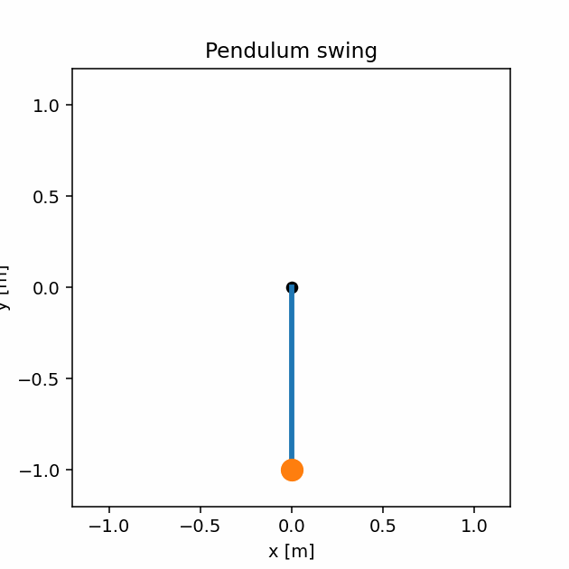

# Pendulum Swing-Up via Dynamic Programming to Balance via LQR



A minimal, reproducible project that learns a **value function** on a coarse mesh to **swing up** a torque-actuated pendulum, then hands off to **LQR** to **balance** at the upright.  

This follows ideas from *Underactuated Robotics (MIT), “Dynamic Programming 3”*: value iteration with function approximation, **barycentric (simplex) interpolation** for off-grid evaluations, careful use of **discounting**, and an **LQR** stabilizer near equilibrium.

---

## Project layout

```
.
├── pendulum_env.py        # environment: CT dynamics, RK4, linearization, ZOH, GIF export
├── dp_tool.py             # grid value iteration + barycentric interpolation (A→C diagonal)
├── run_pendulum.py        # trains DP, simulates, LQR handoff, writes outputs/pendulum_swing.gif
├── external/
│   └── msdcontrol/        # (git submodule) LQR implementation; installable as a package
└── outputs/
    └── pendulum_swing.gif # generated animation (created by run_pendulum.py)
```

---

## Prerequisites

- Python 3.9+
- Packages: `numpy`, `matplotlib`, `pillow` (GIF writer). Optional: `scipy` (DARE fallback if the submodule isn’t available).

```bash
pip install numpy matplotlib pillow
# optional, for SciPy DARE fallback:
pip install scipy
```

---

## Setup

### 1) Make the submodule importable

**Recommended (editable install):**
```bash
pip install -e external/msdcontrol
```


---

## Run

```bash
python run_pendulum.py
```

This will:

1. Run **value iteration** on a coarse grid over $(\theta,\dot\theta)\$ and a small set of torques.  
2. **Simulate** closed-loop: DP policy far from upright to **LQR** near upright.  
3. Save an **animated GIF** to `outputs/pendulum_swing.gif`.

---

## Configuration & tuning

Open `run_pendulum.py` and adjust these knobs:

```python
# grids (speed vs. fidelity)
th_grid  = np.linspace(-np.pi, np.pi, 65)   # try 49, 65, 101
dth_grid = np.linspace(-8.0, 8.0, 49)       # try 37..81
actions  = np.linspace(-env.p.u_limit, env.p.u_limit, 15)  # try 11..21

# value iteration
gamma     = 0.995     # 0.995..0.999 stabilize targets
dt        = 0.02
max_iters = 200
tol       = 5e-4
```

**Runtime scales** roughly with `len(th_grid) × len(dth_grid) × len(actions) × iters`.  
Start with `49×37×11` for quick tests, then refine.

**Tips**
- Keep `dt` modest so one step doesn’t jump across many cells.
- If convergence stalls, slightly increase `gamma` or `max_iters`.

---

## How this maps to the “Dynamic Programming 3” lecture

- **Function approximation:** A state grid with **barycentric interpolation** is a **linear** approximator in the stored $.  
- **Discounting:** A small \(\gamma<1\) keeps Bellman targets bounded while fitting (note: this slightly changes the optimal controller; acceptable here because LQR handles the local regime precisely).  
- **Action handling:** For clarity we sample a modest set of torques in the backup. A common extension is to avoid action grids by computing a **closed-form greedy** \(u^*(x) = -R^{-1} f_2(x)^\top \nabla_x \hat J(x)\) in control-affine systems.  
- **LQR near equilibrium:** Linearize about the upright (\(\phi=\theta-\pi\)), discretize (ZOH), and call **DLQR** to obtain \(K\). Handoff occurs when \(|\phi|<0.2\) and \(|\dot\phi|<1.0\) (tunable).

---

## Producing (and customizing) the animated GIF

`run_pendulum.py` calls:

```python
gif_path = env.save_gif(
  thetas=xs[:, 0],
  path="outputs/pendulum_swing.gif",
  dt=dt,
  dpi=140,
  trail=True   # set False to disable trail
)
```

Requirements: `pillow` installed, and the `outputs/` directory (auto-created).  
Coordinates are rendered as \(x=L\sin\theta,\ y=-L\cos\theta\), so angle wrapping is smooth.

---

## Using LQR

This project expects:

```python
from msdcontrol.lqr import dlqr
K, P = dlqr(Ad, Bd, Q, R)  # K is (1,2) for SISO pendulum, P solves DARE
```

There is a SciPy fallback in `run_pendulum.py` if the submodule isn’t importable (`solve_discrete_are`).

---

## Troubleshooting

- **Slow value iteration**  
  Coarsen the grids/actions (e.g., `49×37×11`), relax `tol`, or reduce `max_iters`. 

- **`ImportError: cannot import dlqr`**  
  Ensure submodule is present and installed:
  ```bash
  git submodule update --init --recursive
  pip install -e external/msdcontrol
  ```
  Or use the path-append fallback at the top of `run_pendulum.py`.

- **No GIF produced**  
  Install `pillow` and check that `outputs/` exists (created automatically).

---

## Notes & extensions

- Replace action sampling with **closed-form greedy** \(u^*(x)\) for control-affine dynamics to remove the action grid.  
- Swap mesh DP for a tiny **neural fitted VI** (e.g., 64–64–1 MLP) with a slowly updated target network.  
- Extend to **acrobot**: same scaffolding, larger state; move to on-policy sampling.

---

## Acknowledgments

This implementation is inspired by ideas presented in *Underactuated Robotics (MIT), “Dynamic Programming 3”*—in particular, the use of value iteration with function approximation, barycentric interpolation, discounting for stability, and LQR as a reliable local stabilizer.
